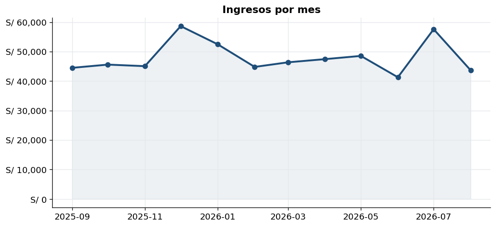
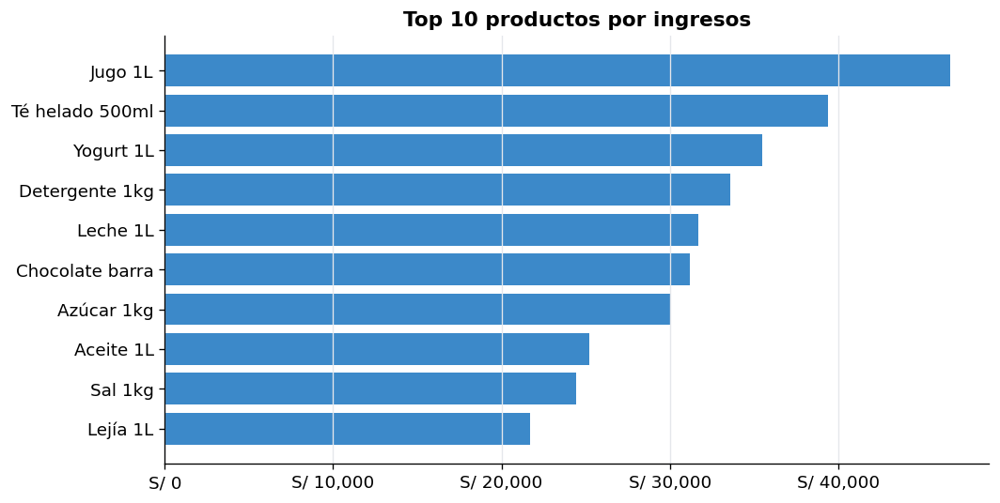
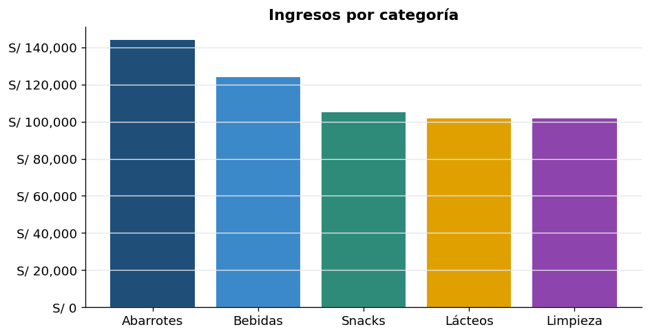
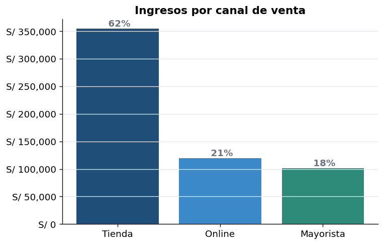
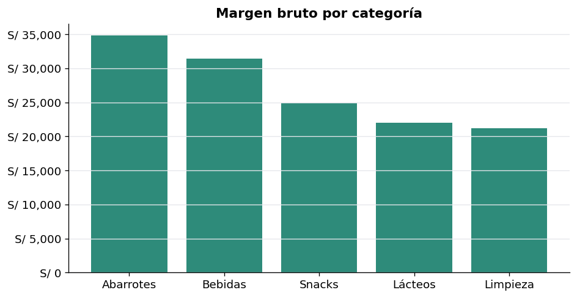
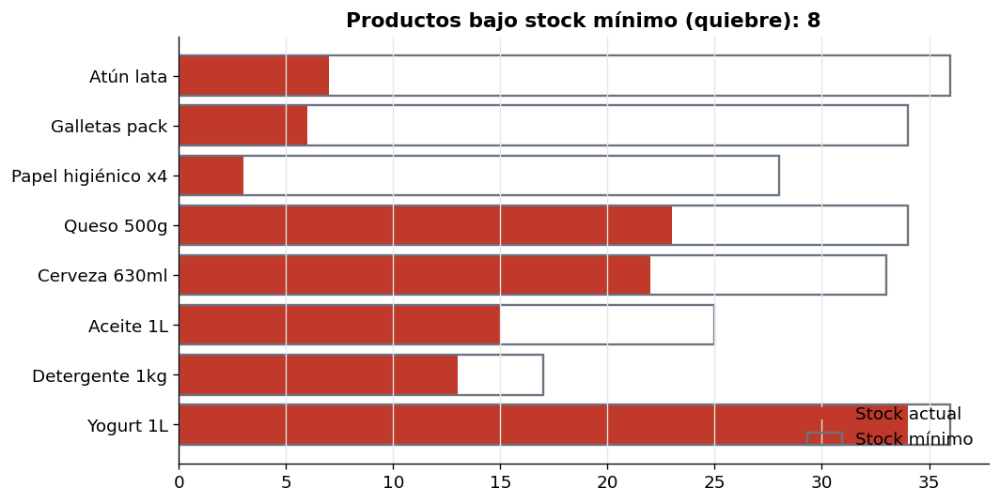

# 📊 Dashboard de Ventas e Inventario

Análisis de **ventas, rotación de productos e inventario** de un pequeño negocio de abarrotes en Lima. El proyecto genera datos de transacciones, los limpia y modela con **Python (Pandas)**, calcula KPIs de negocio y produce visualizaciones para apoyar la toma de decisiones. Incluye además las **consultas SQL** equivalentes.


> **Nota:** el dataset es **sintético** (generado con `generar_datos.py`), creado para demostrar el flujo de análisis sin exponer datos reales de ningún cliente.

---

## 🎯 Pregunta de negocio

> ¿Cómo evolucionan las ventas, qué productos y categorías generan más ingresos y margen, y qué productos están en riesgo de quiebre de stock?

---

## 📈 Resultados (KPIs)

| Indicador | Valor |
|---|---|
| Ingresos totales | **S/ 576,273** |
| Unidades vendidas | **36,417** |
| Margen bruto | **S/ 134,418 (23.3%)** |
| Ticket promedio | **S/ 63.15** |
| Productos en quiebre de stock | **8 de 30** |

---

## 🔍 Hallazgos principales

**Estacionalidad de ingresos** — pico claro en **diciembre** y repunte en enero/julio; útil para planificar compras y campañas.



**Productos y categorías que más aportan** — los ingresos se concentran en un grupo reducido de productos (regla de Pareto), lo que permite priorizar el reabastecimiento.




**Canales de venta** — la mayor parte de los ingresos proviene de **Tienda**, con Online y Mayorista como complemento.



**Rentabilidad por categoría** — permite identificar dónde el margen es más alto, no solo dónde se vende más.



**Alertas de inventario** — **8 productos** están por debajo de su stock mínimo (riesgo de quiebre y pérdida de venta).



---

## ▶️ Cómo ejecutarlo

```bash
# 1. Instalar dependencias
pip install -r requirements.txt

# 2. Generar el dataset (crea productos.csv y ventas.csv)
python generar_datos.py

# 3. Ejecutar el análisis y generar los gráficos
python analisis.py
```

---

## 🧱 Contenido

| Archivo | Descripción |
|---|---|
| `generar_datos.py` | Genera el catálogo de productos y ~9,100 transacciones de 12 meses. |
| `analisis.py` | Limpieza, cálculo de KPIs y generación de los gráficos. |
| `consultas.sql` | KPIs equivalentes en SQL (JOIN, GROUP BY, window functions). |
| `0X_*.png` | Gráficos generados por el análisis. |

---

## 🛠️ Habilidades demostradas

Limpieza y modelado de datos con Pandas · cálculo de KPIs de negocio · visualización · SQL analítico (JOIN, GROUP BY, funciones de ventana) · pensamiento orientado a inventarios y decisiones.
